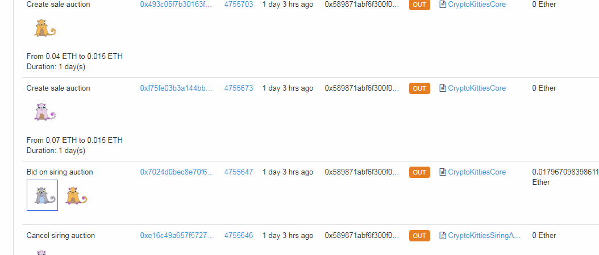
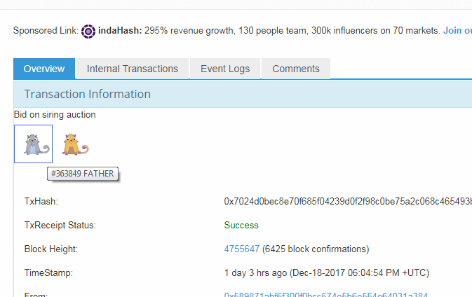

# Etherscan CK Extension #

## Description ##

This extension for etherscan.io let you have a more intuitive visualisation of your transactions from [cryptokitties.io](https://www.cryptokitties.co).

## Installation ##

### Prerequisites ###
You need to have TamperMonkey extension/add on installed in your browser. Here are the links
- [Chrome extension](https://chrome.google.com/webstore/detail/tampermonkey/dhdgffkkebhmkfjojejmpbldmpobfkfo?hl=en) 
- [Firefox add-on](https://addons.mozilla.org/en-US/firefox/addon/tampermonkey/)
 
**Note**: I have not tested this script with other script managers, such as GreaseMonkey or ViolentMonkey. It may work with these

### Installation ###
Open-up the TamperMonkey Dashboard, create a new script and then paste the [script code](https://raw.githubusercontent.com/wishhhmaster/EtherscanCKExtension/master/script.js) inside.

### Updates ###

Open-up the TamperMonkey Dashboard, select the Etherscan CK extension script, edit it and replace it with the content of the [script code](https://raw.githubusercontent.com/wishhhmaster/EtherscanCKExtension/master/script.js)
 
 
## Usage ##

Navigate to your address page on etherscan.io

Click on a transaction to see its details, or navigate to the Internal Transactions tab and click on the parent's transaction link.
This will open up a transactions details page, and display on top the action (bid/sale,...) and the kitties involved.

Once you've navigated to a transaction details page, the transaction info will also appear on the table.

If you find this extension useful, donations or kitties are welcome at this address: 0x589871abf6f300f0bcc574e5b6e554e64031a384
